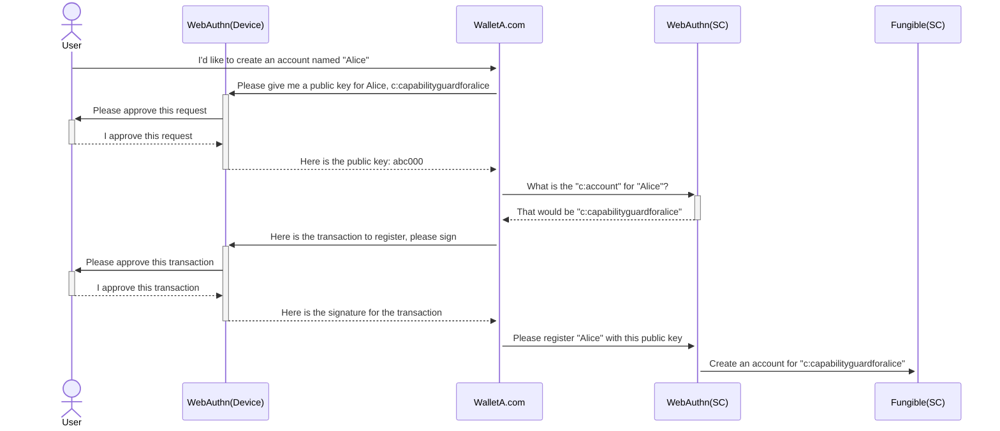
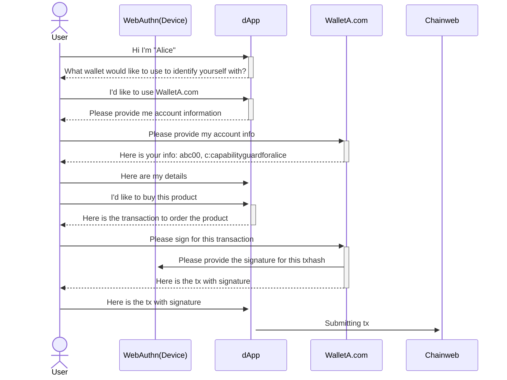
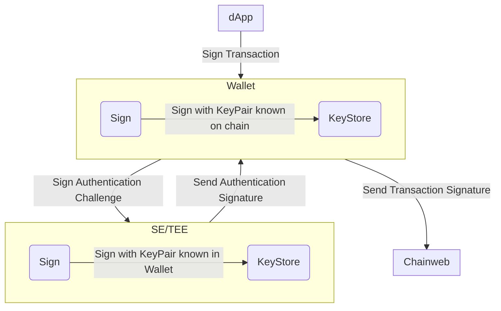
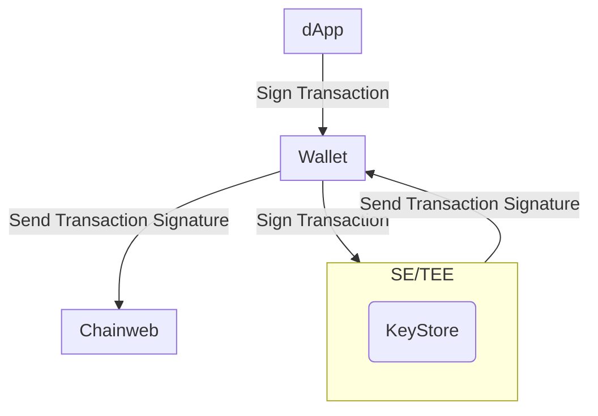

# Abstract

We propose leveraging WebAuthn signatures as an alternative to ED25519
signatures for creating passwordless accounts and approving transactions
processed through Chainweb Node and Pact smart contracts.

# Motivation

The current user experience for creating an account and signing transactions can
be challenging for users unfamiliar with blockchain technology:

- The concept of public / private keypairs is not widely understood.
- Wallets often generate a 12-24 word mnemonic phrase that users need to store
  securely in addition to a traditional password.

Wallets access their private keys via software. This means that if the wallet is
compromised, the user's key pairs can be used to sign without the user's
awareness. With Kadena SpireKey you will always be prompted to personally sign
for every transaction, which provides more security, transparency and control.

Mnemonic phrases are difficult to store securely and easy to lose. WebAuthn
enables users to securely generate and store key pairs directly on their own
hardware devices. There is no need to remember a mnemonic phrase. These key
pairs can typically be accessed via Touch ID or Face ID, allowing users to log
in and sign transactions without passwords. Since access is only granted using
biometric authentication, the need for passwords is removed. Additionally, using
WebAuthn key pairs provides a user-friendly and convenient experience similar to
services like Apple Pay or Google Pay.

# Specifications

## Webauthn Pact Keysets

The WebAuthn public key that we provide to Chainweb Node is composed of a JSON
Web Key (JWK) that has been base64 encoded and prefixed with `WEBAUTHN-`. The
prefix indicates that different validation needs to be applied in Chainweb Node
and Pact. This, however, should not impact any smart contracts as WebAuthn
public keys are accepted as part of any keyset in Pact.

```pact
(env-data
  { 'ks :
    { 'keys :
    ["WEBAUTHN-a50102032620012158206fb822acf87bea4a37c2d5ff067675456bd38afc4f3d43afd0c7d2c94cd997d6225820c464ff1bccf536172dea9eb37ae3bbfc411bf129afda751ea2f7faace4dbf9c8"]
    , 'pred : 'keys-all
    }
  }
)
(enforce-keyset (read-keyset 'ks))
```

### WebAuthn Keysets

WebAuthn keysets are generated directly on the user's hardware device. This
process involves creating a public/private key pair where the private key
remains securely stored on the device, and the public key is shared with the
service for authentication purposes.

#### Cloud Backup

When generating keysets without cloud syncing, the private key never leaves the
user's hardware device. For added convenience, backup and syncing can be enabled
which involves encrypting the private key on the device before uploading it to a
cloud service. Because the private key only leaves the device in its encrypted
form, it remains secure even if the cloud storage is compromised.

Backing up your WebAuthn keysets to the cloud can be particularly useful if you
lose your device, as the private key will still be accessible through your cloud
provider, allowing you to restore access on a new device.

#### Retrieving the Public Key

The JWK used to compose the public key for Pact keysets can be generated using
the
[Web Authentication API](https://developer.mozilla.org/en-US/docs/Web/API/Web_Authentication_API)
on the browser using specific
[configuration options](https://developer.mozilla.org/en-US/docs/Web/API/CredentialsContainer/create#publickey_object_structure)
to create an "account".

Notes about specific configuration options:

- `challenge`: When creating new credentials, a `challenge` will be requested by
  the Web Authentication API. Since the creation of new credentials only
  requires retrieval of the JWK and no signatures need to be created in the
  process, the challenge value is arbitrary so we can provide any value that
  satisfies the API.
- `pubKeyCredParams`: Currently Chainweb Node only supports the `ES256`
  encryption algorithm. This is represented by the algorithm value `-7`
- `user`: The user requires an `id` which needs to be unique for every account.
  If a new account is created using the same `id` as an existing account, the
  former account will be overwritten and lost. It is best to ensure that this
  `id` is unique, otherwise you may not be able to access assets guarded by the
  Pact keyset derived from the lost account.
- `rp`: rp stands for `relying party` and will default to the document origin
  when it is omitted. This is provided because webauthn keys are always tied to
  a specific domain and cannot be used with any other domains

```js
var publicKeyConfig = {
  challenge: Uint8Array.from("arbitrary-string"),

  // Relying Party:
  rp: {
    name: 'Kadena SpireKey',
    id: window.location.hostname, // defaults to the document origin when omitted
  },

  user: {
    id: Uint8Array.from("Alex Müller" + Date.now())
    name: 'alex.mueller@example.com',
    displayName: 'Alex Müller',
  },

  // This Relying Party will accept an ES256 credential
  pubKeyCredParams: [
    {
      type: 'public-key',
      alg: -7, // "ES256" as registered in the IANA COSE Algorithms registry
    },
  ],

  authenticatorSelection: {
    // Try to use UV if possible. This is also the default.
    userVerification: 'preferred',
  },

  timeout: 60000, // 1 minute

  attestation: "direct" // Retrieves the attestation statement as generated by the authenticator
};
```

## Chainweb Node Requests

When using WebAuthn to sign for transactions, Chainweb Node requires some
additional information to validate signatures.

> In the below json schema's the new or updated attributes are prefixed with a
> `+`.

### Sigs Payload

`ED25519` signatures are generated by signing the transaction `hash` using the
private key which Chainweb Node can validate using the public key.

When using WebAuthn signatures, the authenticator (the hardware device used to
generate the keyset and sign for transactions) will sign a message constructed
using `authenticatorData` and `clientDataJSON`. In order to validate the
signature, this data will need to be provided along with the signature to
Chainweb Node.

To do this, you will first need to create a JSON object of the `signature`,
`authneticatorData`, and `clientDataJSON`.

```json
{
+ "signature": string,
+ "authenticatorData": string,
+ "clientDataJSON": string,
}
```

You will then need to stringify this object and pass it to the `sig` field in
the transaction.

```json
{
  "cmd": string,
  "hash": string,
  "sigs": [{
+   "sig": string // Stringified JSON
  }],
}
```

### Command Payload

In the command payload the `signers` array provides information about the public
key(s) that will be signing the request. The `scheme` should indicate that the
signature will be provided via `WebAuthn`.

```json
{
  "payload": {
    "exec": {
      "code": string,
      "data": json
    },
  },
  "meta": {
    "chainId": string,
    "creationTime": number,
    "gasLimit": number,
    "gasPrice": number,
    "sender": string,
    "ttl": number
  },
  "networkId": string,
  "nonce": string,
  "signers": [{
    "clist": [{
      "name": string,
      "args": [string|number]
    }],
+   "pubKey": string,
+   "scheme": "ED25519" | "WebAuthn"
  }]
}
```

## WebAuthn Smart Contracts

In order to manage accounts guarded by a `WebAuthn` key, two new smart contracts
will be introduced: `webauthn-guard` and `webauthn-wallet`.

This approach creates a thin layer of abstraction over the keysets, enabling an
account to have multiple devices associated with it. As a result, an account is
not restricted to the devices known at the time of registration, but retains the
flexibility to add new devices or replace existing ones.

### WebAuthn Guard Smart Contract

The `webauthn-guard` contract handles account management and authorization. It
keeps track of all the keysets associated with an account and allows users to
configure how many keysets need to sign for authorization and additional keyset
registration requests.

> This account architecture takes inspiration from how keysets work in Pact. For
> example, a webauthn guard is like a multi-key keyset with a minimum approval
> predicate, however it allows for adding additional keys in retrospect and
> there can be custom minimum approval requirements for adding new keys.

The following is a snippet of the account schema from `webauthn-guard`:

```pact
(defschema device-schema
  name          : string
  domain        : string
  credential-id : string
  guard         : guard
)

(defschema account-schema
  @model [
    (invariant (> (length devices) 0))
    (invariant (< (length devices) 5))
    (invariant (> min-approvals 0))
    (invariant (> min-registration-approvals 0))
    (invariant (<= min-approvals (length devices)))
    (invariant (<= min-registration-approvals (length devices)))
  ]
  devices                    : [object{device-schema}]
  min-approvals              : integer
  min-registration-approvals : integer
)
```

> Note: `device` refers to a webauthn keyset in this context, however any keyset
> can be used as a `device`.

The `id` for each `webauthn-guard` account is derived from the principal of the
keyset used to create the account. When the principal is created from the
keyset, Pact identifies the keyset as being of the WebAuthn type and generates a
`w:account`. Given the uniqueness of all WebAuthn keysets, only the person with
access to the original account should be able to access the same `w:account` on
other chains.

To create the same account on different chains, we recommend using the `copy`
function. This function recreates the account in its current state on another
chains by executing a defpact to transfer the current `account-schema` to the
new chain. This process acts like a new registration and requires the user to
meet the `min-registration-approval` criteria.

#### Registering an existing account with a new wallet

Accounts created with the `webauthn-guard` contract can be accessed through
multiple wallets. Although WebAuthn keysets are domain-specific (i.e., users can
only sign transactions with the keysets generated on their original wallet),
additional keysets from another wallet can be added if the registration
requirements are met with the original wallet's keysets. This provides users
with greater flexibility in choosing wallets and reduces dependence on any
single wallet.

### WebAuthn Wallet Smart Contract

The `webauthn-wallet` contract is designed to facilitate the integration of
webauthn-guard accounts with existing `fungible-v2` contracts.

To create a `fungible-v2` account, you need to provide an account name and a
guard. Since Pact accepts capabilities as guards, `webauthn-wallet` performs the
following steps:

- Creates a capability guard using the `w:account` from `webauthn-guard`
- Uses the `c:account` as the guard for the `fungible-v2` account

By employing a capability guard, we are able to enforce the requirements of the
`webauthn-guard` account and use the associated keysets to secure the
`fungible-v2` account.

#### Account Management

Each `webauthn-wallet` account has a `w:account` that is used as the identifier
for the `webauthn-guard` and a `c:account` which is used for the `fungible-v2`.
To simplify account management, `webauthn-wallet` wraps some functions, allowing
users to only track their `c:account`. The following functions from
`webauthn-guard` are wrapped by `webauthn-wallet`:

- add-device
- remove-device
- copy-account

#### WebAuthn Wallet Capabilities

Since `fungible-v2` accounts are guarded by a capability, transactions requiring
authentication must bring in `webauthn-wallet` capabilities into scope.

Most contracts should be written with `webauthn-guard` and `webauthn-wallet` in
mind. However, the `coin` contract, being non-upgradable, will likely not
accommodate `webauthn-wallet` accounts. As a result, you cannot bring the
`webauthn-wallet.DEBIT` capability into scope when using native `coin`
functions/capabilities. To address this, the `webauthn-wallet` contract provides
the following functions/capabilities as alternatives to their `coin`
counterparts:

- `coin.transfer` _(function)_ -> `webauthn-wallet.transfer`
- `coin.GAS` _(capability)_ -> `webauthn-wallet.GAS_PAYER` &
  `webauthn-wallet.GAS`
- `coin.TRANSFER` _(capability)_ -> `webauthn-wallet.TRANSFER`

> Note: Due to the way chainweb processes the `GAS_PAYER` capability,
> `webauthn-wallet` accounts will need to sign for an additional
> `webauthn-wallet.GAS` capability when paying for gas. We are working on a
> solution to simplify the interface further, which will become available in the
> next chainweb release.

## Registration flow



## Sign for transaction (dApp)



## Sign flow Traditional Wallet



## Sign flow WebAuthn Wallet


