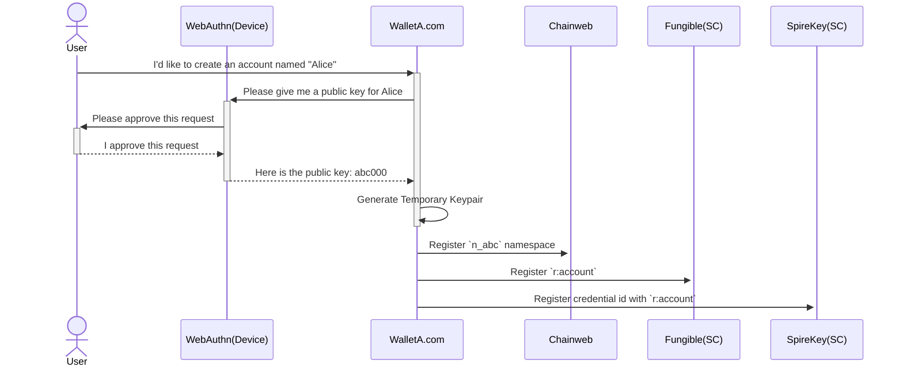
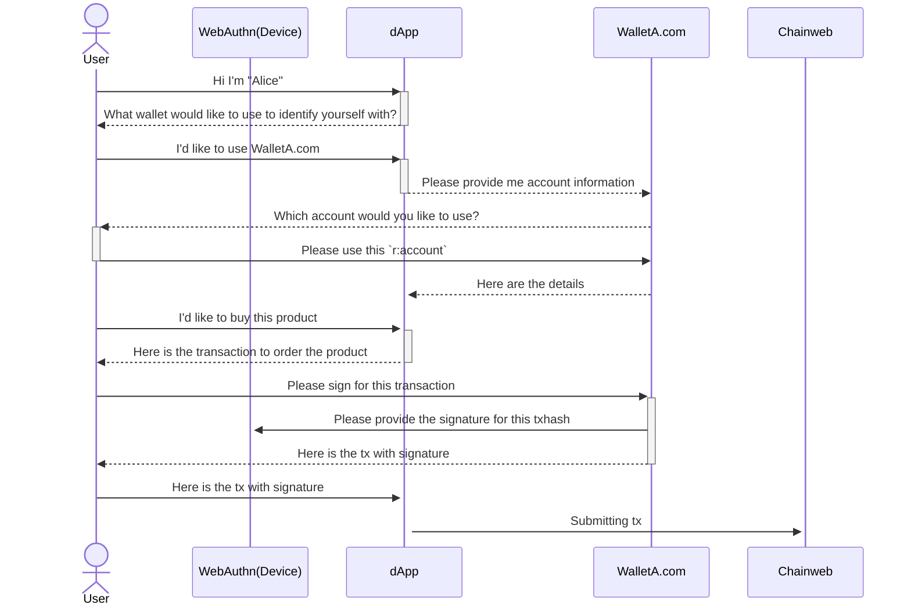
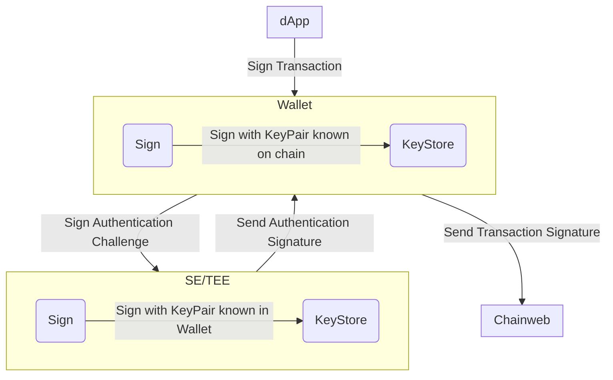
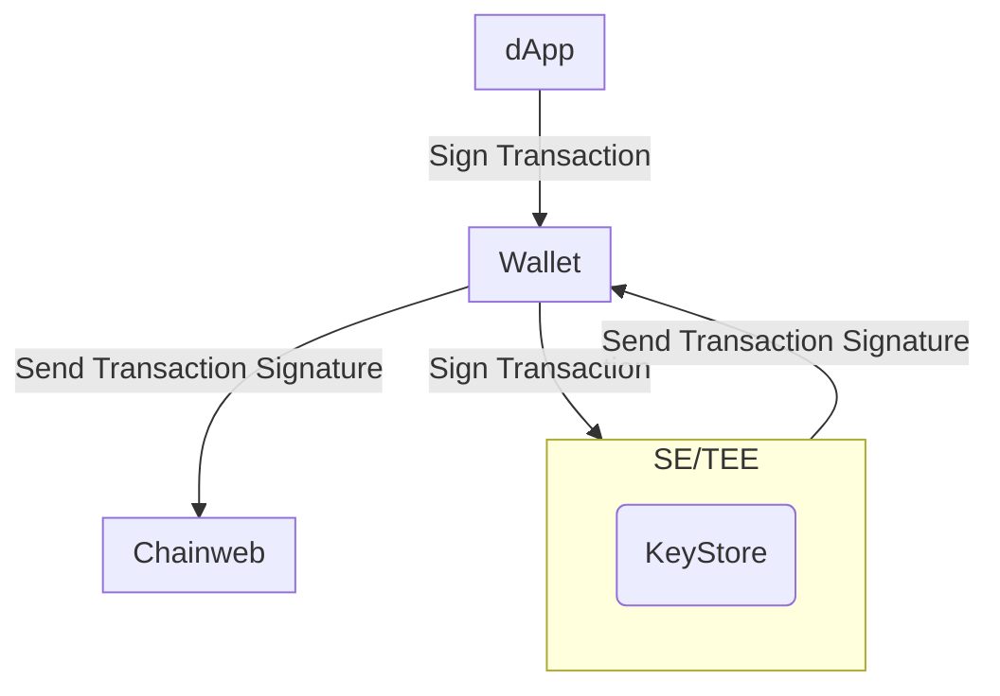

# Abstract

We propose leveraging WebAuthn signatures as an alternative to ED25519
signatures for creating passwordless accounts and approving transactions
processed through Chainweb Node and Pact smart contracts.

# Motivation

The current user experience for creating an account and signing transactions can
be challenging for users unfamiliar with blockchain technology:

- The concept of public / private keypairs is not widely understood.
- Wallets often generate a 12-24 word mnemonic phrase that users need to store
  securely in addition to a traditional password.

Wallets access their private keys via software. This means that if the wallet is
compromised, the user's key pairs can be used to sign without the user's
awareness. With Kadena SpireKey you will always be prompted to personally sign
for every transaction, which provides more security, transparency and control.

Mnemonic phrases are difficult to store securely and easy to lose. WebAuthn
enables users to securely generate and store key pairs directly on their own
hardware devices. There is no need to remember a mnemonic phrase. These key
pairs can typically be accessed via Touch ID or Face ID, allowing users to log
in and sign transactions without passwords. Since access is only granted using
biometric authentication, the need for passwords is removed. Additionally, using
WebAuthn key pairs provides a user-friendly and convenient experience similar to
services like Apple Pay or Google Pay.

# Specifications

## Webauthn Pact Keysets

The WebAuthn public key that we provide to Chainweb Node is composed of a JSON
Web Key (JWK) that has been base64 encoded and prefixed with `WEBAUTHN-`. The
prefix indicates that different validation needs to be applied in Chainweb Node
and Pact. This, however, should not impact any smart contracts as WebAuthn
public keys are accepted as part of any keyset in Pact.

```pact
(env-data
  { 'ks :
    { 'keys :
    ["WEBAUTHN-a50102032620012158206fb822acf87bea4a37c2d5ff067675456bd38afc4f3d43afd0c7d2c94cd997d6225820c464ff1bccf536172dea9eb37ae3bbfc411bf129afda751ea2f7faace4dbf9c8"]
    , 'pred : 'keys-all
    }
  }
)
(enforce-keyset (read-keyset 'ks))
```

### WebAuthn Keysets

WebAuthn keysets are generated directly on the user's hardware device. This
process involves creating a public/private key pair where the private key
remains securely stored on the device, and the public key is shared with the
service for authentication purposes.

#### Cloud Backup

When generating keysets without cloud syncing, the private key never leaves the
user's hardware device. For added convenience, backup and syncing can be enabled
which involves encrypting the private key on the device before uploading it to a
cloud service. Because the private key only leaves the device in its encrypted
form, it remains secure even if the cloud storage is compromised.

Backing up your WebAuthn keysets to the cloud can be particularly useful if you
lose your device, as the private key will still be accessible through your cloud
provider, allowing you to restore access on a new device.

#### Retrieving the Public Key

The JWK used to compose the public key for Pact keysets can be generated using
the
[Web Authentication API](https://developer.mozilla.org/en-US/docs/Web/API/Web_Authentication_API)
on the browser using specific
[configuration options](https://developer.mozilla.org/en-US/docs/Web/API/CredentialsContainer/create#publickey_object_structure)
to create an "account".

Notes about specific configuration options:

- `challenge`: When creating new credentials, a `challenge` will be requested by
  the Web Authentication API. Since the creation of new credentials only
  requires retrieval of the JWK and no signatures need to be created in the
  process, the challenge value is arbitrary so we can provide any value that
  satisfies the API.
- `pubKeyCredParams`: Currently Chainweb Node only supports the `ES256`
  encryption algorithm. This is represented by the algorithm value `-7`
- `user`: The user requires an `id` which needs to be unique for every account.
  If a new account is created using the same `id` as an existing account, the
  former account will be overwritten and lost. It is best to ensure that this
  `id` is unique, otherwise you may not be able to access assets guarded by the
  Pact keyset derived from the lost account.
- `rp`: rp stands for `relying party` and will default to the document origin
  when it is omitted. This is provided because webauthn keys are always tied to
  a specific domain and cannot be used with any other domains

```js
var publicKeyConfig = {
  challenge: Uint8Array.from("arbitrary-string"),

  // Relying Party:
  rp: {
    name: 'Kadena SpireKey',
    id: window.location.hostname, // defaults to the document origin when omitted
  },

  user: {
    id: Uint8Array.from("Alex Müller" + Date.now())
    name: 'alex.mueller@example.com',
    displayName: 'Alex Müller',
  },

  // This Relying Party will accept an ES256 credential
  pubKeyCredParams: [
    {
      type: 'public-key',
      alg: -7, // "ES256" as registered in the IANA COSE Algorithms registry
    },
  ],

  authenticatorSelection: {
    // Try to use UV if possible. This is also the default.
    userVerification: 'preferred',
  },

  timeout: 60000, // 1 minute

  attestation: "direct" // Retrieves the attestation statement as generated by the authenticator
};
```

## Chainweb Node Requests

When using WebAuthn to sign for transactions, Chainweb Node requires some
additional information to validate signatures.

> In the below json schema's the new or updated attributes are prefixed with a
> `+`.

### Sigs Payload

`ED25519` signatures are generated by signing the transaction `hash` using the
private key which Chainweb Node can validate using the public key.

When using WebAuthn signatures, the authenticator (the hardware device used to
generate the keyset and sign for transactions) will sign a message constructed
using `authenticatorData` and `clientDataJSON`. In order to validate the
signature, this data will need to be provided along with the signature to
Chainweb Node.

To do this, you will first need to create a JSON object of the `signature`,
`authneticatorData`, and `clientDataJSON`.

```json
{
+ "signature": string,
+ "authenticatorData": string,
+ "clientDataJSON": string,
}
```

You will then need to stringify this object and pass it to the `sig` field in
the transaction.

```json
{
  "cmd": string,
  "hash": string,
  "sigs": [{
+   "sig": string // Stringified JSON
  }],
}
```

### Command Payload

In the command payload the `signers` array provides information about the public
key(s) that will be signing the request. The `scheme` should indicate that the
signature will be provided via `WebAuthn`.

```json
{
  "payload": {
    "exec": {
      "code": string,
      "data": json
    },
  },
  "meta": {
    "chainId": string,
    "creationTime": number,
    "gasLimit": number,
    "gasPrice": number,
    "sender": string,
    "ttl": number
  },
  "networkId": string,
  "nonce": string,
  "signers": [{
    "clist": [{
      "name": string,
      "args": [string|number]
    }],
+   "pubKey": string,
+   "scheme": "ED25519" | "WebAuthn"
  }]
}
```

## R:Accounts

Principal accounts don't allow keysets to be rotated. However there exists one
principal type that facilitates this behavior, the `r:account`. An `r:account`
is created from a `keyset-ref-guard`. To protect such keyset, users should only
create referenced keysets on a `principal namespace`.

### Principal namespace

A principal namespace is created using a `keyset`, ensuring only the owner of
that `keyset` to initialize that namespace on a chain. Initializing such keyset
is not an intuitive process and makes the onboarding more difficult.

To combat this we propose to use a `temporary keypair` to be part of the keyset
to create the `principal namespace` and `r:account`. The wallet will be able to
sign using the `temporary keypair` to authorize the transaction to create both
the `principal namespace` as well as the `r:account`. This way the user does not
need to sign for this initialization for each chain, preventing a tedious
repetition of performing the biometric authentication for each chain.

The `temporary keypair` should be removed and forgotten after creation of the
account. The attack vector is therefor similar to traditional wallets during
account and namespace creation and after the creation will be more secure as
there will be no more `private keys` involved with authorizing these assets.

### WebAuthn Credential Ids

To sign for a transaction the wallet needs to initialize the transaction using
the credential id paired with the keypair. Therefor the wallet needs to keep
track of what credential id belongs to what public key. This can be stored
in traditional wallets, but we propose to also store this information on chain
to ease the process of transitioning wallets.

The credential information will be stored in `spirekey.pact` allowing users
to keep track of what credential id's belong to their `r:account`.

#### Registering an existing account with a new wallet

Accounts guarded by a `r:account` can rotate their keyset using any keypair.
This includes traditional wallets or hardware wallets. Wallets have to prepare
the keyset to be modified and rotated into the `r:account`.

## Registration flow



## Sign for transaction (dApp)



## Sign flow Traditional Wallet



## Sign flow WebAuthn Wallet


