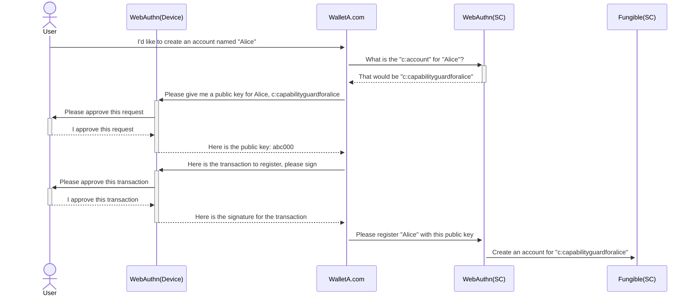
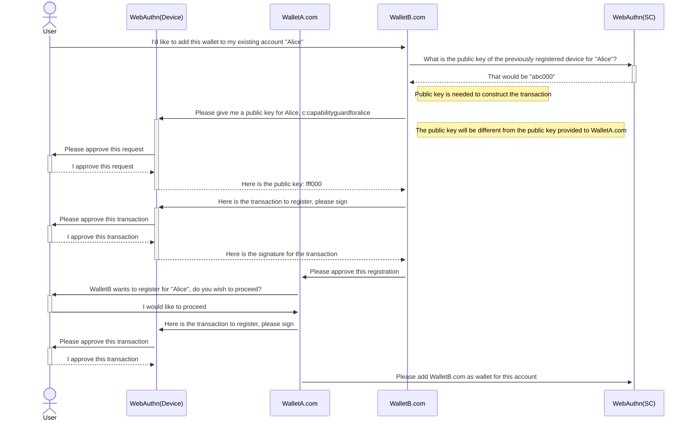
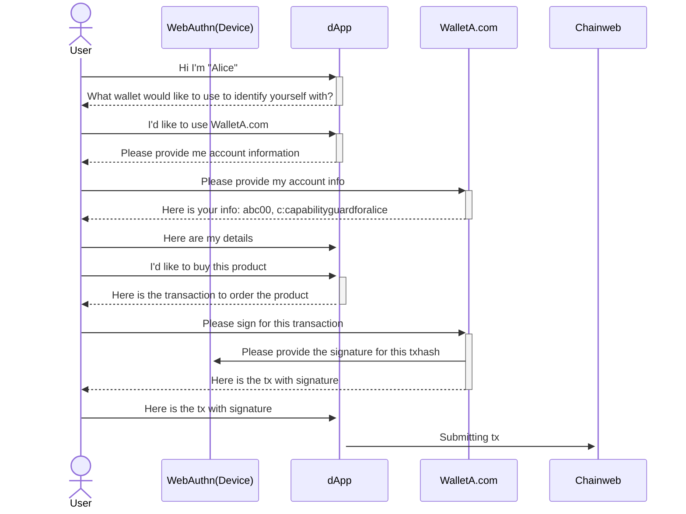
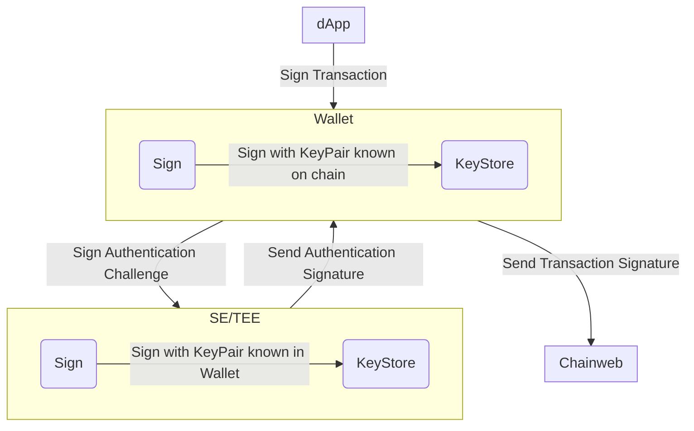
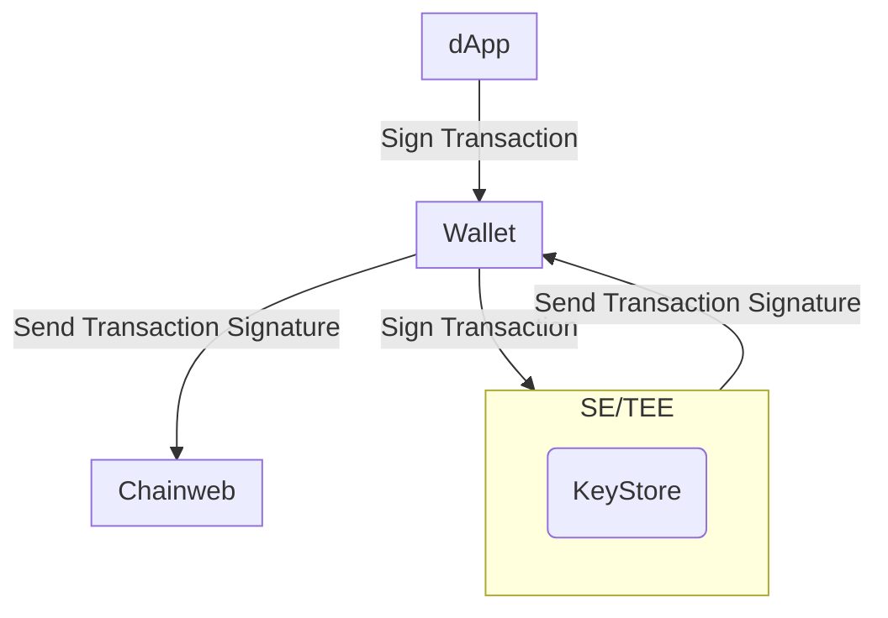

# Abstract

We propose to use WebAuthn signatures as an alternative option to the current
ED25519 signatures to allow users to approve for transactions processed through
Chainweb Node and Pact smart contracts.

# Motivation

WebAuthn allows for users to use a hardware powered device to store keypairs
securely. Users will be able to interact with those stored keypairs only by
initiating a sign request from the registered web domain. The private key never
leaves the device and the user never enters a password. This brings the user
more security and convenience simultaneously.

In comparison to current wallets, the wallet developers have no access to the
private keys. The user does not have to write down their mnemonics or even enter
their password to decrypt their privatekeys.

# Specifications

## Schema Sketch

In the below json schema's the new or updated attributes are prefixed with a `+`

### Chainweb Node Request

A WebAuthn sign request is slightly different than a usual signature. The
authenticator signing the request appends on the `challenge` additional data.
For our `ED25519` signatures we use the private key to sign for the `hash` as
message. WebAuthn attaches the `authenticatorData` and `clientDataJSON` to the
message before signing. That data will be provided along with the signature.

In order to verify the signature you therefore need to first reconstruct the
message using the `hash`, `authenticatorData` and `clientDataJSON`.

```json
{
  "cmd": string,
  "hash": string,
  "sigs": [
    {
      "sig": string,
+     "authenticatorData": string,
+     "clientDataJSON": string,
    }
  ]
}
```

### Command Payload

In the command payload the `signers` array provides information about the public
key that will be signing for this request. The `scheme` should indicate that the
signature will be provided via `WebAuthn`.

The public key should be described in base64 encoded `JWK` format. This allows
for greater flexibility in the future when Chainweb Node decides to accept more
algorithms. The `JWK` format allows for the clients constructing the request to
remain blissfully unaware of what algorithm is used by the authenticator.

_NOTE: Additionally Chainweb Node could provide a new endpoint that describes
which_ _algorithms to support, using the
[Allow credentials](https://www.w3.org/TR/webauthn-2/#dom-publickeycredentialrequestoptions-allowcredentials)_
_description._

```json
{
  "payload": {
    "exec": {
      "code": string,
      "data": json
    },
  },
  "meta": {
    "chainId": string,
    "creationTime": number,
    "gasLimit": number,
    "gasPrice": number,
    "sender": string,
    "ttl": number
  },
  "networkId": string,
  "nonce": string,
  "signers": [{
    "clist": [{
      "name": string,
      "args": [string|number]
    }],
+   "pubKey": string,
+   "scheme": "ED25519" | "WebAuthn"
  }]
}
```

### Pact Keyset

In Pact the public key should be accepted as part of any keyset. This allows
Smart Contracts to use the registered keysets as any other keyset. This should
not be impacting any smart contracts, other than more types of public keys being
accepted. The WebAuthn key will be prefixed with `WEBAUTHN-` to allow different
validations to be applied on the keys in `Chainweb Node` and `Pact`.

```pact
(env-data
  { 'ks :
    { 'keys :
    ["WEBAUTHN-a50102032620012158206fb822acf87bea4a37c2d5ff067675456bd38afc4f3d43afd0c7d2c94cd997d6225820c464ff1bccf536172dea9eb37ae3bbfc411bf129afda751ea2f7faace4dbf9c8"]
    , 'pred : 'keys-all
    }
  }
)
(enforce-keyset (read-keyset 'ks))
```

## WebAuthn Smart Contracts

In order to manage accounts guarded by a `WebAuthn` key, two new smart contracts
will be introduced. This is done to put a thin layer of abstraction on top of
the keysets and allow an account to be able to have multiple devices attached in
retrospect. This way an account is not limited to the devices known during
registration, but keeps the ability to add more or rotate devices out of the
guard.

### WebAuthn Guard Smart Contract

This smart contract is managing an account that keeps track of all keys tied to
this account. It also allows for a user to define how many keys needs to sign
for authorization requests and registration requests separately. The schema
looks like:

```pact
(defschema device-schema
  name          : string
  domain        : string
  credential-id : string
  guard         : guard
)
(defschema account-schema
  @model [
    (invariant (> (length devices) 0))
    (invariant (> min-approvals 0))
    (invariant (> min-registration-approvals 0))
    (invariant (<= min-approvals (length devices)))
    (invariant (<= min-registration-approvals (length devices)))
  ]
  devices                    : [object{device-schema}]
  min-approvals              : integer
  min-registration-approvals : integer
)
```

The id of the account is derived from the keyset defined in the first
registration device. This will result in a `w:account`. With this device the
account can be created on any chain and will always result in the same
`w:account`.

In the event where the first device has been lost, a user can make use of a copy
function. The copy function will perform a `defpact` where the account state of
any given chain will be copied over to a new chain. The user will have to sign
with enough keys to satisfy the amount of keys defined with the
`min-registration-approvals` setting.

### WebAuthn Wallet Smart Contract

This smart contract is a thin wrapper around the `WebAuthn Guard` contract and
`fungible-v2` contract references. Based on the `w:account` created in the
`WebAuthn Guard` contract a new `c:account` will be created in the
`WebAuthn Wallet` contract. The capability to guard the `fungible-v2` accounts
will inherit the principal properties from the `WebAuthn Guard` account and make
sure that account ownership is protected using the same mechanism.

#### WebAuthn Wallet Capabilities

The `WebAuthn Wallet` capablities will guard the actions of the account. The
main capability to guard the account is based on: `DEBIT`. This capability has
the `w:account` as parameter. To make sure end users are not required to
understand all the concepts, we have split the capabilities they will sign for.
Those capabilities will provide an abstraction on top of the `w:account`.

Users will be presented with the `TRANSFER` capability. This capability will
expect the user's `c:account` the `account` of the receiver known in the
`fungible-v2` contract and the `amount` to transfer. So the capability to sign
would look like:

```pact
(n_56...bc.webauthn-wallet.TRANSFER "c:LR1...Dx0" "any-account" 1.0)
```

Additionally the `WebAuthn Wallet` contract will provide for some easy wrappers
around management functions of the `WebAuthn Guard` contract. This way the end
users can manage their `WebAuthn Guard` without the burden of knowing the
`w:account` and all they need to keep track of is the `c:account`

The `WebAuthn Wallet` will wrap the following functions from the
`WebAuthn Guard`:

- add-device
- remove-device
- copy-account

## Registration flow



## Registration flow (second wallet)



## Sign for transaction (dApp)



## Sign flow Traditional Wallet



## Sign flow WebAuthn Wallet


