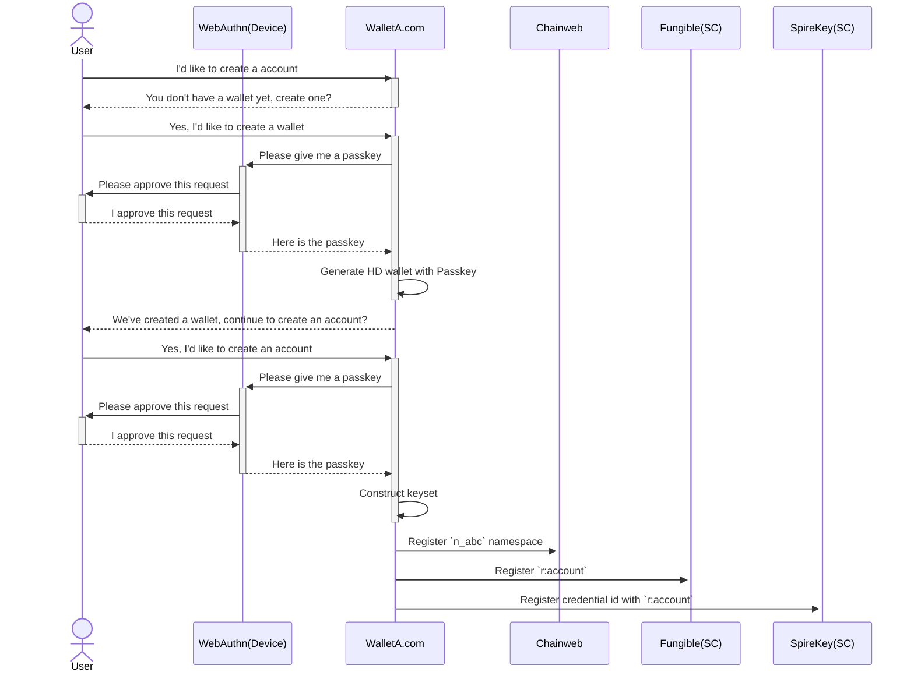
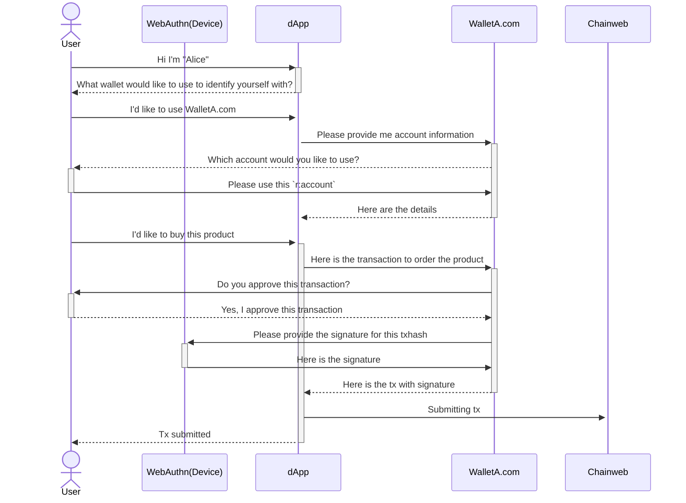
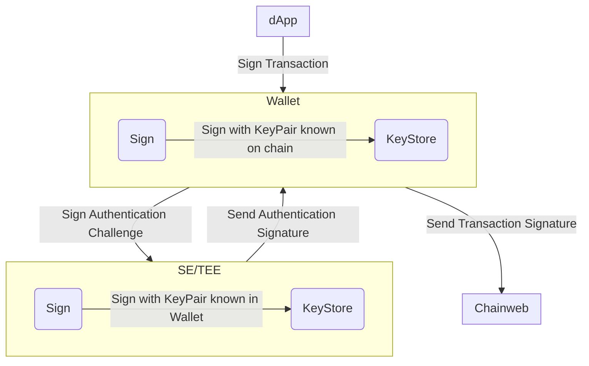
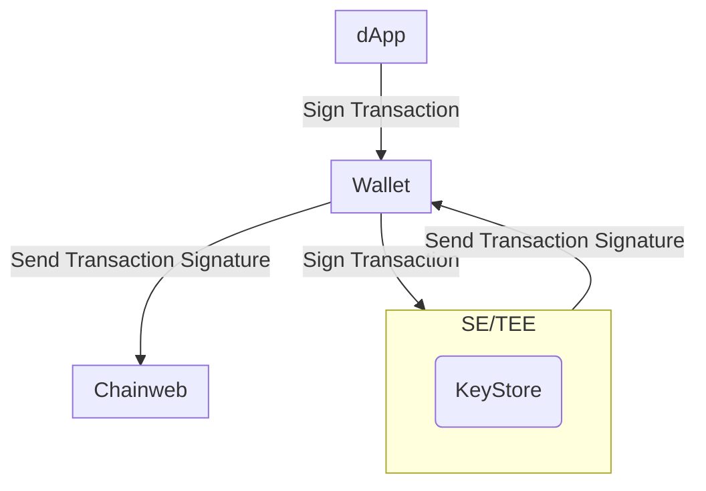

# Abstract

This document describes the proposal to leverage WebAuthn signatures as an
alternative to ED25519 signatures, paving the way for users to create
passwordless accounts and approve transactions without managing public and
private keys. With this proposal, transactions from Pact smart contracts that
are processed by Chainweb nodes can be signed with biometric authentication.

# Motivation

The current user experience for creating an account and signing transactions can
be challenging for users unfamiliar with blockchain technology:

- The concept of public and private key pairs is not widely understood.
- Wallets often generate a 12 to 24 word mnemonic phrase that users need to
  store securely in addition to a traditional password.

People often underestimate the importance of keeping their private keys secure,
and are likely to lose, mistype, or unintentionally expose them. Wallets also
typically access private keys through software that, if compromised, might be
used to sign transactions without a user's consent. With Kadena SpireKey and
WebAuthn signatures, key pairs are stored directly on a secure enclave on the
user's own devices. Storing keys in this way prevents the private key from being
exposed or lost. In addition, Kadena SpireKey prompts users to sign for every
transaction, providing greater security, transparency, and control.

Similarly, mnemonic phrases are difficult to store securely and easy to lose.
With support for WebAuthn signatures, Kadena SpireKey enables users to securely
generate and store key pairs directly on their own hardware devices, without
needing to remember or store a mnemonic phrase. The key pairs stored on devices
can typically be accessed using biometric authentication—like Touch ID or Face
ID—allowing users to log in and sign transactions without passwords.
Additionally, WebAuthn has a convienient service provided to sync the key pairs
to the cloud, in the form of `Passkeys`. This service allows users to make use
of any `Passkey Provider` of their choice, removing the reliance on big
corporations to store key pairs.

# Specifications

This section provides technical specifications for the implementation of this
proposal.

## Account creation

The `coin` contract removed the ability to rotate the governance predicate (e.g. a keyset) associated with a principal account since `v6`. This
change protects users from front-running attacks and squatting attacks. To allow
new devices to be added retroactively to an account, we need to use a principal
type that allows keysets to be rotated. This new principal type is called the
`r:account` principal.

An `r:account` is created from a `keyset-ref-guard`. To protect users from
front-running and squatting attacks, the `keyset-ref-guard` uses a
`principal namespaces`. A `principal namespace` is created using a `keyset`, so
that only the owner of that `keyset` can initialize the namespace on a chain.

A keyset that is used to create the `principal namespace` is not intuitive and
makes the onboarding more difficult. It's paramount to make sure the user has
access to the keyset to initialize the namespace on new chains. For this reason,
one `Passkey` is used as an entropy to create a hierarchical deterministic (HD)
wallet. A second `Passkey` is created to be included in the keyset used to
create the `principal namespace` and the `r:account`.

For example:

```pact
(env-data
  { 'ks :
    { 'keys :
      [ "WEBAUTHN-public-key"
      , "ED25519-public-key-derived-from-HD-wallet-with-Passkey-entropy"
      ]
    , 'pred : 'keys-any
    }
  }
)
```

With the keyset composed of a HD wallet-derived public key and a Passkey, we can
start the process of creating the `principal namespace` and `r:account`. To
assist users maintaining their key pairs, we store the credential id's on chain
in the `kadena.spirekey` contract. This contract allows wallets to keep track of
the devices that are authorized to sign for transactions and allows the
management of these devices to be decentralized.

```pact
(let* (
  (ns-name (ns.create-principal-namespace (read-keyset 'ns-keyset)))
  (ks-ref-name (format "{}.{}" [ns-name 'kadena]))
)
  (define-namespace
    ns-name
    (read-keyset 'ns-keyset )
    (read-keyset 'ns-keyset )
  )
  (namespace ns-name)
  (define-keyset ks-ref-name
    (read-keyset 'ns-keyset)
  )
  (let (
    (account (create-principal (keyset-ref-guard ks-ref-name)))
  )
    (coin.create-account
      account
      (keyset-ref-guard ks-ref-name)
    )
    (kadena.spirekey.add-device-pair
      account
      coin
      { 'guard          :  (read-keyset 'spirekey-keyset) ; keyset of HD wallet derived public key and Passkey
      , 'credential-id  :  "${credentialId}" ; Credential ID of the device
      , 'domain         :  "${domain}" ; https://example.com
      , 'device-type    :  "${deviceType}" ; AAGUID of the device or phone|desktop|security-key if not available
      , 'color          :  "${color}" ; hex color of the device (optional for user to customize and further identify the device across different wallets)
      }
    )
  )
)
```

## Transaction signing

In most cases, users should use the Passkey for the `r:account` to sign
transactions. This signing method is the most secure way to sign transactions.
However, there are situations where it would be beneficial to use the HD
wallet-derived public key to sign a transaction. For example, it might be
beneficial to use the HD wallet-derived public key to sign transactions that
perform account maintenance or prepare cross-chain operations for a dApp.

Using a HD wallet-derived public key to sign for transactions is not as secure
as using the Passkey. The HD wallet-derived public key is read into memory and,
therefore, can be targeted by malware, similar to traditional wallets. The
Passkey's private key is never read into memory and is, therefore, more secure.

## Extracting a mnemonic phrase

The Passkey used as entropy to create the HD wallet can also be used to extract
the mnemonic phrase. The ability to extract a mnemonic phrase allows users to
migrate to a traditional wallet if they wish to do so and to have another way to
back up their wallet.

## Retrieving Passkey information

The JSON Web Key (JWK) used to compose the public key for Pact keysets can be
generated using the
[Web Authentication API](https://developer.mozilla.org/en-US/docs/Web/API/Web_Authentication_API)
on the browser using specific
[configuration options](https://developer.mozilla.org/en-US/docs/Web/API/CredentialsContainer/create#publickey_object_structure)
to create an "account".

Notes about specific configuration options:

- `challenge`: When creating new credentials, the Web Authentication API
  requests a `challenge` property to be provided. Because creating new
  credentials only requires the retrieval of the JWK and no signatures need to
  be created in the process, the challenge value is arbitrary and can be any
  value that satisfies the API.
- `pubKeyCredParams`: Currently, Chainweb nodes only support the `ES256`
  encryption algorithm. This is represented by the algorithm value `-7`.
- `user`: The user requires an `id` which needs to be unique for every account.
  If a new account is created using the same `id` as an existing account, the
  former account will be overwritten and lost. It is best to ensure that this
  `id` is unique, otherwise you may not be able to access assets guarded by the
  Pact keyset derived from the lost account.
- `rp`: rp stands for `relying party` and will default to the document origin
  when it is omitted. This is provided because WebAuthn keys are always tied to
  a specific domain and cannot be used with any other domains.

```js
var publicKeyConfig = {
  challenge: Uint8Array.from("arbitrary-string"),

  // Relying Party:
  rp: {
    name: 'Kadena SpireKey',
    id: window.location.hostname, // defaults to the document origin when omitted
  },

  user: {
    id: Uint8Array.from("Alex Müller" + Date.now())
    name: 'alex.mueller@example.com',
    displayName: 'Alex Müller',
  },

  // This Relying Party will accept an ES256 credential
  pubKeyCredParams: [
    {
      type: 'public-key',
      alg: -7, // "ES256" as registered in the IANA COSE Algorithms registry
    },
  ],

  authenticatorSelection: {
    // Try to use UV if possible. This is also the default.
    userVerification: 'preferred',
  },

  timeout: 60000, // 1 minute

  attestation: "direct" // Retrieves the attestation statement as generated by the authenticator
};
```

The response from the Web Authentication API contains the `credentialId` and the
`publicKey` that can be used to create a keyset for the `r:account`.

```json
{
  "id": "credentialId",
  "type": "public-key",
  "rawId": "Uint8Array",
  "response": {
    "clientDataJSON": "Uint8Array",
    "attestationObject": "Uint8Array"
  },
  "clientExtensionResults": {}
}
```

The AAGUID for a device is a 16 byte value that is unique to the device. This
identifier can be used to identify the device and show the user the Passkey
provider that's used to store the key pairs. The AAGUID can be retrieved from
the `attestationObject` in the response from the Web Authentication API. For
more information about the AAGUID, see the following articles:

- [Determine Passkey with AAGUID](https://web.dev/articles/webauthn-aaguid)
- [AAGUID Mapping](https://github.com/passkeydeveloper/passkey-authenticator-aaguids)

## Chainweb node requests

When using WebAuthn to sign for transactions, Chainweb nodes require some
additional information to validate the signatures.

> In the below json schema's the new or updated attributes are prefixed with a
> `+`.

### Sigs payload

`ED25519` signatures are generated by signing the transaction `hash` using the
private key that Chainweb node can validate using the public key.

When using WebAuthn signatures, the authenticator—that is, the hardware device
used to generate the keyset and sign for transactions—signs a message
constructed using `authenticatorData` and `clientDataJSON`. To validate the
signature, this data needs to be provided along with the signature to the
Chainweb node.

To validate the signature:

1. Create a JSON object with the `signature`, `authneticatorData`, and
   `clientDataJSON`.

```json
{
+ "signature": string,
+ "authenticatorData": string,
+ "clientDataJSON": string,
}
```

2. Stringify this object and pass it to the `sig` field in the transaction.

```json
{
  "cmd": string,
  "hash": string,
  "sigs": [{
+   "sig": string // Stringified JSON
  }],
}
```

### Command payload

In the command payload, the `signers` array provides information about the
public key(s) that are signing the request. The `scheme` should indicate that
the signature provided is `WebAuthn`.

```json
{
  "payload": {
    "exec": {
      "code": string,
      "data": json
    },
  },
  "meta": {
    "chainId": string,
    "creationTime": number,
    "gasLimit": number,
    "gasPrice": number,
    "sender": string,
    "ttl": number
  },
  "networkId": string,
  "nonce": string,
  "signers": [{
    "clist": [{
      "name": string,
      "args": [string|number]
    }],
+   "pubKey": string,
+   "scheme": "ED25519" | "WebAuthn"
  }]
}
```

## Registration flow



## Sign for transaction (dApp)



## Signing flow for a traditional wallet



## Signing flow for a WebAuthn wallet


