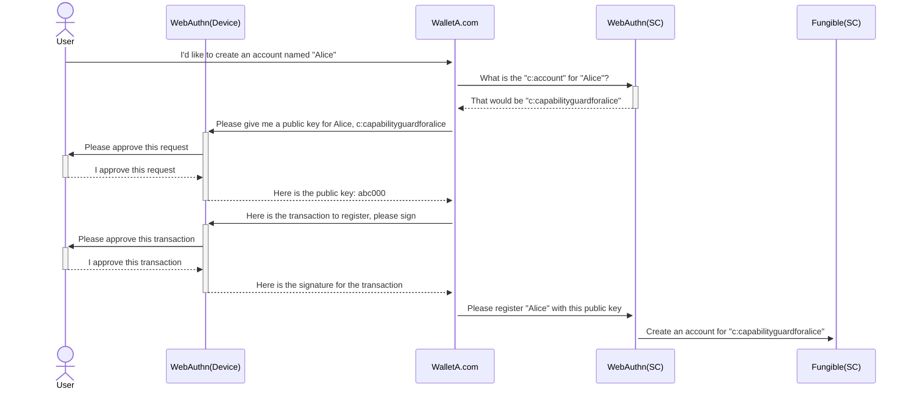
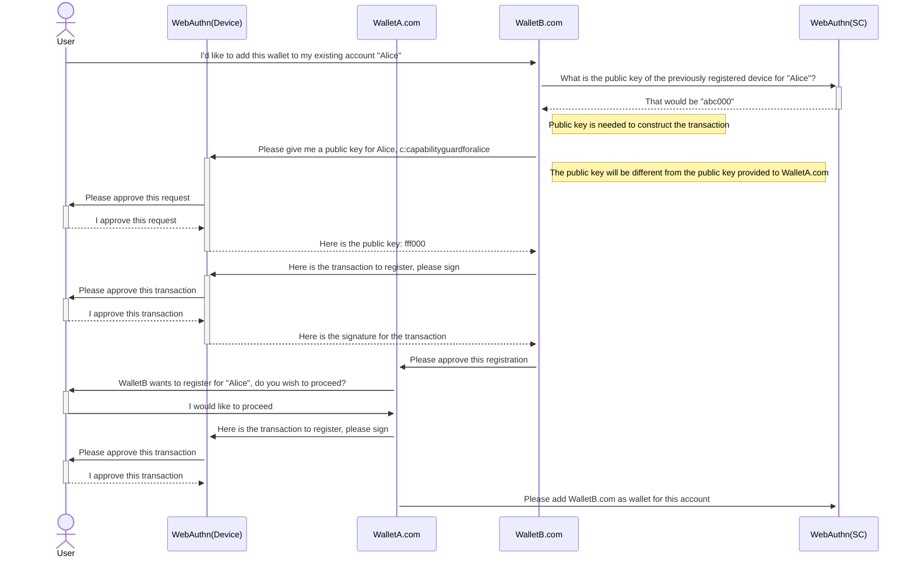
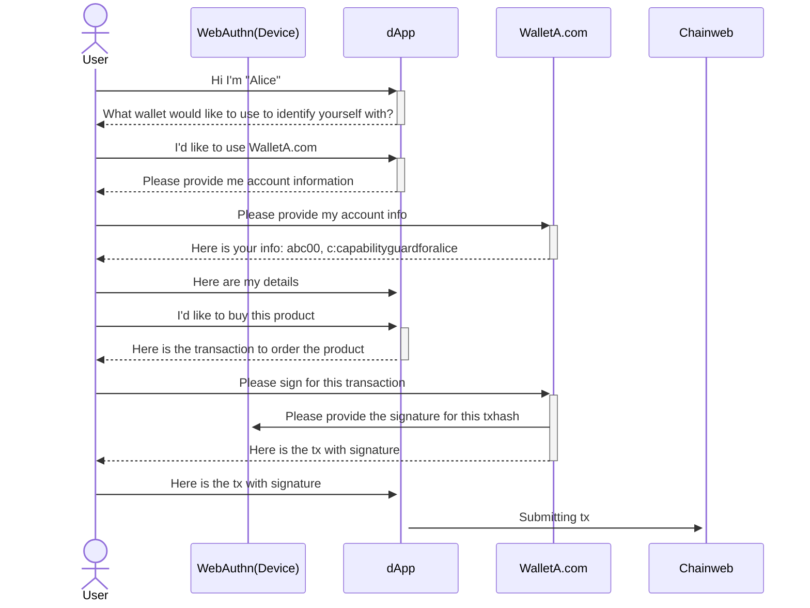

# Abstract

We propose to use WebAuthn signatures as an alternative option to the current
ED25519 signatures to allow users to approve for transactions processed through
Chainweb Node and Pact smart contracts.

# Motivation

WebAuthn allows for users to use a hardware powered device to store keypairs securely.
Users will be able to interact with those stored keypairs only by initiating a sign
request from the registered web domain. The private key never leaves the device
and the user never enters a password. This brings the user more security and convenience
simultaneously.

In comparison to current wallets, the wallet developers have no access to the
private keys. The user does not have to write down their mnemonics or even enter
their password to decrypt their privatekeys.

# Specifications

## Schema Sketch

In the below json schema's the new or updated attributes are prefixed with a `+`

### Chainweb Node Request

A WebAuthn sign request is slightly different than a usual signature. The authenticator
signing the request appends on the `challenge` additional data. For our `ED25519` signatures
we use the private key to sign for the `hash` as message. WebAuthn attaches the
`authenticatorData` and `clientDataJSON` to the message before signing. That data
will be provided along with the signature.

In order to verify the signature you therefore need to first reconstruct the message
using the `hash`, `authenticatorData` and `clientDataJSON`.

```json
{
  "cmd": string,
  "hash": string,
  "sigs": [
    {
      "sig": string,
+     "authenticatorData": string,
+     "clientDataJSON": string,
    }
  ]
}
```

### Command Payload

In the command payload the `signers` array provides information about the
public key that will be signing for this request. The `scheme` should
indicate that the signature will be provided via `WebAuthn`.

The public key should be described in base64 encoded `JWK` format. This
allows for greater flexibility in the future when Chainweb Node decides to
accept more algorithms. The `JWK` format allows for the clients constructing
the request to remain blissfully unaware of what algorithm is used by the
authenticator.

_NOTE: Additionally Chainweb Node could provide a new endpoint that describes which_
_algorithms to support, using the [Allow credentials](https://www.w3.org/TR/webauthn-2/#dom-publickeycredentialrequestoptions-allowcredentials)_
_description._

```json
{
  "payload": {
    "exec": {
      "code": string,
      "data": json
    },
  },
  "meta": {
    "chainId": string,
    "creationTime": number,
    "gasLimit": number,
    "gasPrice": number,
    "sender": string,
    "ttl": number
  },
  "networkId": string,
  "nonce": string,
  "signers": [{
    "clist": [{
      "name": string,
      "args": [string|number]
    }],
+   "pubKey": string,
+   "scheme": "ED25519" | "WebAuthn"
  }]
}
```

### Pact Keyset

In Pact the public key should be accepted as part of any keyset.
This allows Smart Contracts to use the registered keysets as any other
keyset. This should not be impacting any smart contracts, other than
more types of public keys being accepted.

_NOTE: A keyset using such a base64 encoded public key might exceed_
_the current limitations of a principaled acount length for newer algorithms_

```pact
(env-data
  { 'ks :
    { 'keys :
    ["eyJrdHkiOiJFQyIsImFsZyI6IkVTMjU2IiwiY3J2IjoiUC0yNTYiLCJ4IjoiNy02UHRXYmxhNUdUSTJaZ3VpTU43UXhaTmZKQXlXTzAzTDRaUHVoSG5ydyIsInkiOiI0UlVuOU54eWRUdU5DOTR5YWx6RUV4c2pianJsVy1xbkV4REg0emM3aUIwIn0"]
    , 'pred : 'keys-all
    }
  }
)
(enforce-keyset (read-keyset 'ks))
```

## Registration flow



## Registration flow (second wallet)



## Sign for transaction (dApp)


